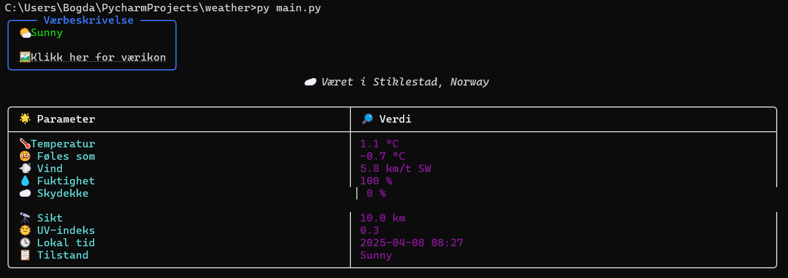

# 🌦️ Weather Viewer på Norsk 🇳🇴

Et lite Python-program som henter og viser dagens vær i Stiklestad fra [WeatherAPI](https://www.weatherapi.com/), med farger, ikoner og norsk språk.

## 📸 Eksempel



## 🚀 Kom i gang

1. **Installer avhengigheter:**

```bash
pip install -r requirements.txt
```

2. **Start:**

```bash
py main.py
```